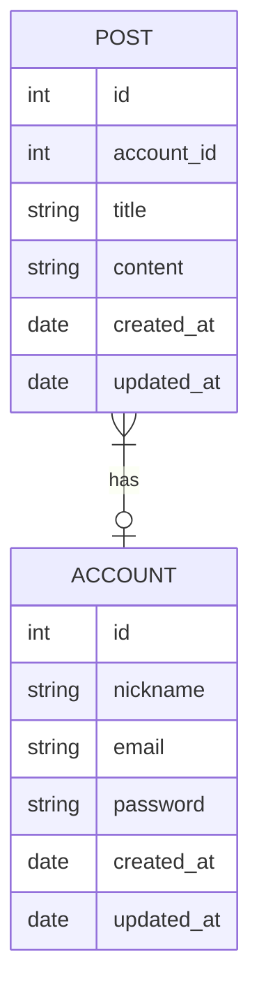

# Kotlin MVC

## Feature
- [ ] sign in / sign up
- [ ] CRUD about account
- [ ] CRUD about post

## Entity

```mermaid
erDiagram
    POST {
        int id
        int account_id
        string title
        string content
        date created_at
        date updated_at
    }
    ACCOUNT {
        int id
        string nickname
        string email
        string password
        date created_at
        date updated_at
    }
    POST }|--o| ACCOUNT : has
```